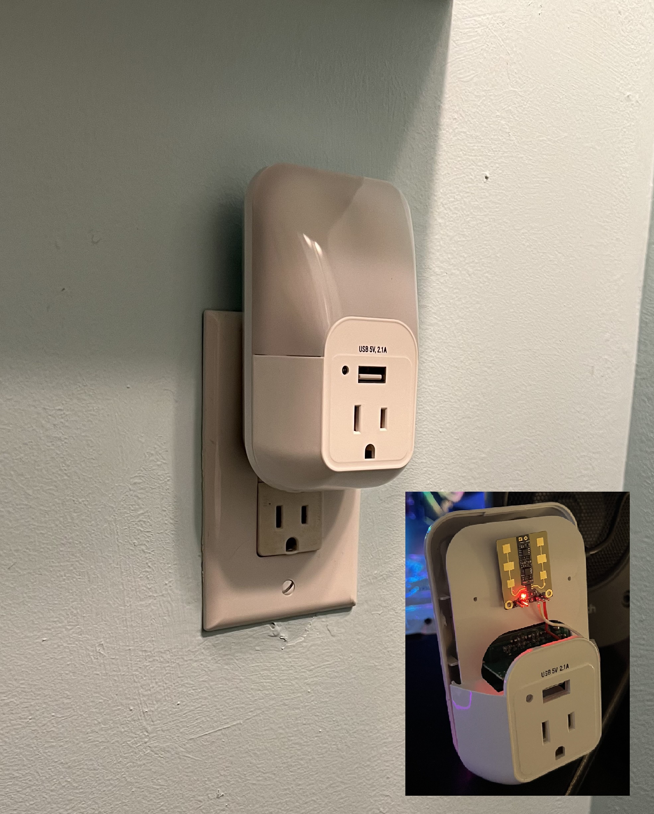

# espresence-mmwave-nightlight-sensor
Making a hidden mmWave presence sensor that looks like it belongs in a nice bathroom or hallway!



Just like the Everything Presence One, my DIY version has an mmWave sensor, a PIR motion sensor, light illuminance, and a combo temperature/humidity sensor. Similarly it's added into Home Assistant by using the ESPHome add-on.

While the code file: espresence-multi-sensor.yaml basically gives you all the connection and pinout info needed bring this project to life... some assemnbly notes and images can be found here [here](static/project.md)!

### Installation:
 * Download these files and copy them (keeping their subfolder paths) into your Home Assistant config/esphome main folder:

   ```
   header/leapmmw_sensor.h
   
   packages/leapmmw_sensor.yml
   ```
 
 * In Home Assistant add-on, click ESPHome>open web gui and create a new device chosing the "continue" option and give it a name such as:

   ```
   espresence-office-multi-sensor
   ```

* Click next and chose the type of ESP module you used in your build, this isn't a critical thing to have match but as long as it's some kind of ESP32 you can just select that for now and click next.
* You'll see a new card appear in the background for your ESP device, this is just an empty shell with only basic initilization code so far... click skip because you don't want to install this basic code to the ESP quite yet.
