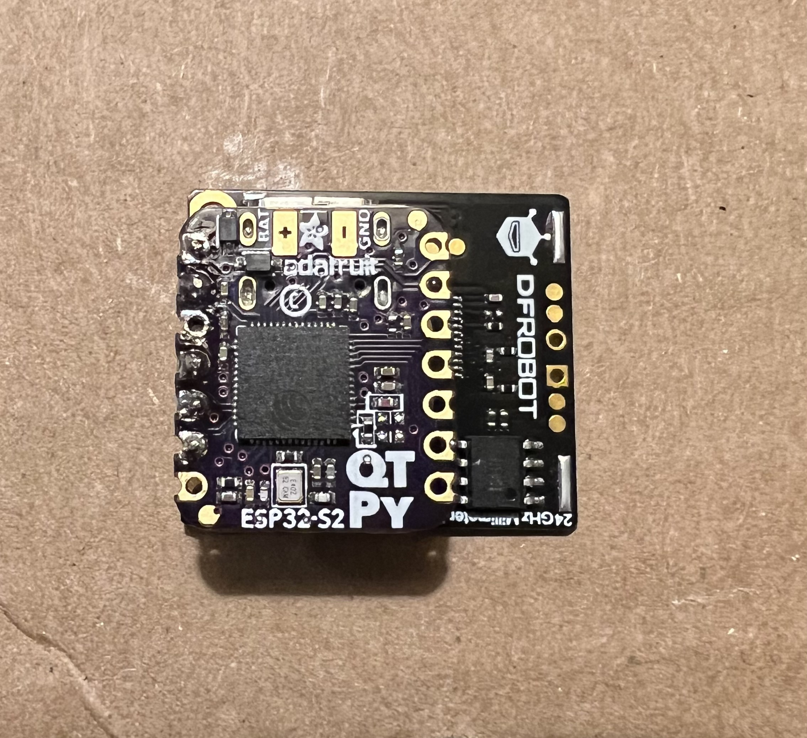

# Opening up and modifying the first model I got from Amazon

As mentioned, the unit is simply screwed together and inside its quite spacious so adding the ESP8266 and mmWave sensor was easy. I used the stacked header pins as the method of attachment and sandwitched the internal nightlight reflector between them:

This worked well for my prototype except for one minor issue which was a single tall capacitor was obstructing things when I tried to reassemble so I simple de-soldered it and replaced it laid over using some angled breakaway header pins, no sweat:

For the prototype I tapped into the 5v right at the USB header which might have seemed obvious but wasn't the easiest place to work and the garbage wire I used made it even more annoying but after some swearing, I got it done:

# Thoughts and Possible Refinements

The prototype was fine, I'm still using it in a hallway but I did learn a few things and make improvements in my design:

* Use good wire! I've mentioned this before, I found the super thin cheap wires I started using to be quite difficult to silver and almost impossible to get solder to flow over/into the stranded wires. But fast-forward to Version 2 and I used some nicer all copper wire and it was super easy!
* In version 2 I tapped into the 5v on the main outlet extender circuit board where the solder joints were very heavy and easy to work with as long as you have a good iron that can make a large solder joint flow
* One of the coolest things about this solution is that the nightlight still works! I don't know why that's so exciting to me lol, perhaps because originally I intended to repurpose, not add function to the nightlight I ordered to tinker with. But there was an issue with shadows being cast inside the nightlight from the electronics I added inside which I addressed (mostly) in the Version 2 model
* You may need to angle your mmWave sensor depending on where in a room you have an outlet to use with this solution. For this reason, and to reduce the internal shadows, I changed how I mounted the electronics so that I could angle it in any direction and still keep the face of the sensor mostly flat and out of the light beam when the nightlight was active so less or no shadows

Prototype internal nightlight shadows:

# Building Version 2!

Version 2 looks no different on the outside but it's another brand and has some subtle internal differences... really nothing of note. However, I decided to change the ESP module from a Wemos D1 Mini ESP32 to an Adafruit QT py ESP32-S2 which is so small it fits on the tip of your finger:

Honestly it's so tiny, I doubted it actually had WiFi at first, especially given there is no obvious antenna as there is on most other ESP32/8266 models. Also, and with some careful choices on pin assignment in the ESPHome code, the pin alignment and how the mmWave module stacks with the Adafruit ESP32-S2 is just perfect! which makes for such a tiny overall package size:

I used breakaway header pins and removed the plastic so I could make the ESP and mmWave as tight as could be without anything touching. Even with my somewhat lacking soldering skills, the end result was quite fulfilling:

And instead of drilling holes and using the pins going through the reflector to hold things in place, I cut out an area of the reflector entirely and used hot-glue to afix the componets which maybe doesn't look quite as clean internally but it has several advantages such as being able to sink the ESP and mmWave into the unit further so there is virtually no shadowing when the nightlight is active. Also with the small overall sensor package and the magic of hot-glue ;) angling the mmWave sensor pad toward the best area of any space is super easy:

UPDATE: I would not recommend common hot-glue as the slightly warm temperature of the ESP/mmWave (I've noticed) has made the glue come loose. I'm sure another glue could be used that is safe for direct contact with microelectronics and safe at higher temps...

It should be noted that the code and instructions in the main readme.md are for version 2 and specific to the Adafruit ESP32-S2 but this could easily be adapted to anything else you can make work with the mmWave and that you can stuff inside this thing :)
